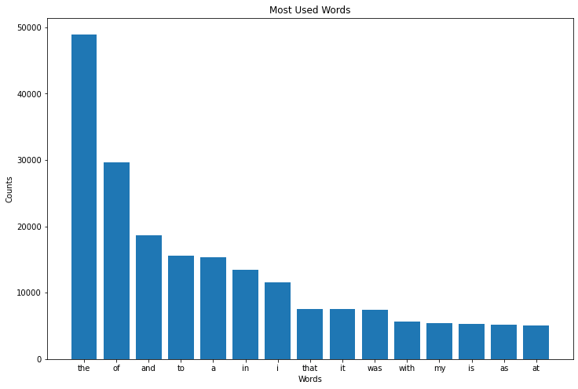

# Edgar-Allen-Poem-Generator

## The Goal: Generate Spooky Poetry
In his early career as a journalist, Edgar Allan Poe wrote an article discussing the "treasures" of scientific discovery in his analysis of one of the first "chess automatons" as he called it. He jabbed at the machine's inability to think creatively and mostly acknowledged the early chess bot as a clever trick. Fast forward to day, and he would probably have a similar reaction to the execution of this project which takes on his name. Creative text generation is not trivial, and typically requires the use of state of the art algorithms like GPT or BERT to do it convincingly. The aim for this project was to create a generator from scratch that could write passable spooky poetry which someone unfamiliar with Poe's work could conceivably believe to be authentic. 

  

## Exploring the Data
The dataset was composed of [70 short stories](https://www.kaggle.com/leangab/poe-short-stories-corpuscsv) from Edgar Allan Poe. I began exploring the data by creating a bar graph of word counts to make note of which words were used most commonly by Poe. Poe's vocabulary is notoriously arcane and dark, however his most commonly used words tend to be more general ones. 

  

While this graph highlights a large disparity in word usage, it also helps us set a baseline expectation for model performance. With a total word count of 24,775 unique words, a baseline model that simply predicts the most common word, "the", would be correct 7.3% of the time.
  

**Preprocessing**
The text data was processed in two different ways depending on the type of neural network it was being fed into. One preprocessing pipeline converted the short stories into sequences of 20 words with the 21st word in any given sequence being the target. The word based model would use these sequences predict the next word given some seed for context. By feeding our model the next sequence of words, including the newly predicted word, the model can continue to generate new words given a small amount of starter text. The other pipeline converted the text into individual characters and used the same method of prediction on a new character based model to generate poetry. Using this strategy, the generated poems had punctuation and structure more similar to Poe's actual work.

## Model Selection
Since natural language is a very structured form of communication which relies heavily on word and character order to convey meaning, this project required the use of a recurrent neural network (RNN) to account for that inherent structure. I specifically worked with long shert-term memory (LSTM) models which have the ability to "recall" and "forget" previous information to contextualize predictions. This type of model is commonly used for text generation along with standard RNNs. 
**Model Tuning**
The first model created was a simple word based LSTM model 

  

## Model Evaluation
  

## Conclusions

  

Below are the top five most fake and most real articles in the dataset.
  

